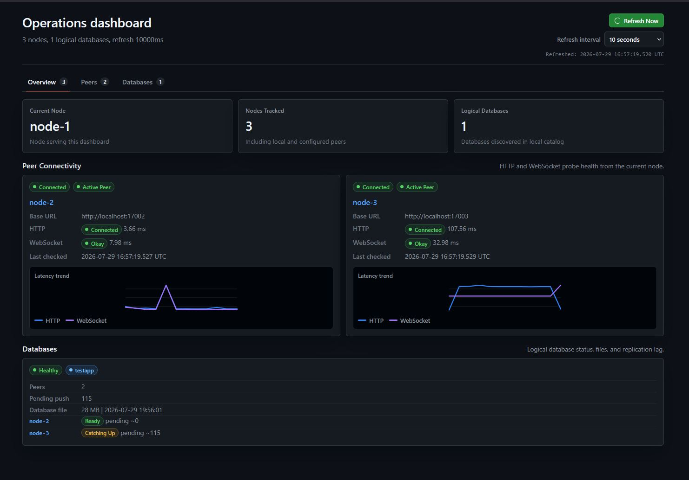
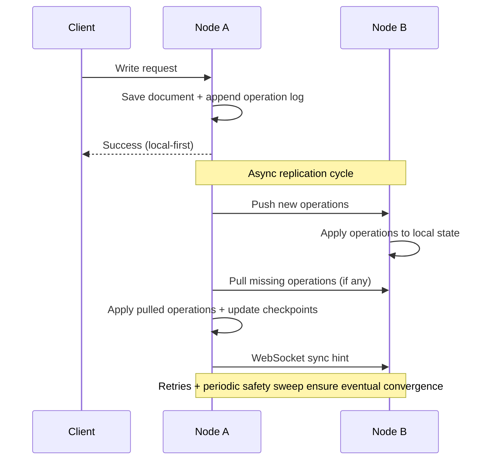

# LiteDb.Distributed

LiteDb.Distributed is a local-first, eventually consistent distributed document database built on top of LiteDB.


Each node:
- Writes locally first.
- Appends immutable operation-log entries.
- Replicates operations (not DB files) to peers.
- Replays remote operations into local materialized state.

## Multi-Database Model

This MVP supports multiple logical databases selected from HTTP headers.

Headers required on every `/api/*` request:
- `Database` (required): logical database name.
- `ApiKey` (required): API key used for database scope and role authorization.

Additional header required for node-to-node endpoints:
- `ReplicationApiKey` (required for `/api/replication/*`, `/api/cluster/*`, and `/ws/replication`): shared cluster key configured by `Node:ReplicationApiKey`.

## Authentication And Authorization

Authentication uses server-level API key authorization (not per-database shared secret matching).

How it works:
- API keys can be scoped to one database, many databases, or all databases (`*`).
- A server root key is configured in `appsettings.json` as `Auth:RootApiKey` and defaults to `"root"`.
- The root key has access to all databases and all roles.
- Non-root keys must be declared in `Auth:ApiKeys` with explicit database scope and role flags.

Example config:

```json
"Auth": {
  "RootApiKey": "root",
  "ApiKeys": [
    {
      "Name": "studio-dev",
      "Key": "dev-123",
      "Databases": [ "testapp", "orders" ],
      "Roles": {
        "ADD_DB": false,
        "DELETE_DB": false,
        "READ_DOCUMENT": true,
        "WRITE_DOCUMENT": true,
        "UPDATE_DOCUMENT": true,
        "DELETE_DOCUMENT": true
      }
    }
  ]
}
```

Role behavior:
- `ADD_DB`: required when the requested `Database` does not exist and must be created.
- `DELETE_DB`: required for database deletion endpoints/flows.
- `READ_DOCUMENT`: required for read/query select operations.
- `WRITE_DOCUMENT`: required for insert/create operations.
- `UPDATE_DOCUMENT`: required for update/replace operations.
- `DELETE_DOCUMENT`: required for delete operations.

Important notes:
- Per-database credential matching is not part of this authentication model.
- Clients without `ADD_DB` cannot auto-create missing databases.
- Studio and tests should use the root key (`root`) when full access is required.
- Node-to-node sync and peer registration require `Node:ReplicationApiKey`; unauthorized nodes cannot join/sync without it.

Query endpoint:

- `POST /api/query`
  - Body: `{ "query": "SELECT $ FROM OrderTransactions LIMIT 200", "take": 200 }`
  - Supports only: `SELECT`, `INSERT`, `UPDATE`, `DELETE`.
  - `INSERT` / `UPDATE` / `DELETE` are executed in safe mode through the document writer pipeline (operation-log append + replication signaling).
  - Safe write-query syntax:
    - `INSERT INTO <collection> VALUES <json-object>` (payload must include `Id` or `_id`)
    - `UPDATE <collection> SET <json-object> [WHERE <filterExpr>]` (affects matching docs through operation-log pipeline, up to `take`)
    - `DELETE FROM <collection> [WHERE <filterExpr>]` (affects matching docs through operation-log pipeline, up to `take`)
  - Only one statement is allowed per request (multi-statement queries are blocked).
  - Response counters:
    - `MatchedCount`: number of documents matched by query filter.
    - `AppliedCount`: number of documents actually mutated (write queries only).

## Cache (Replicated TTL Key/Value)

Each logical database includes a reserved replicated cache collection named `cache`.

- Cache entries are replicated across peers through the normal operation log pipeline.
- Default TTL is `5m` when `ttl` is not provided.
- `ttl` examples: `30s`, `5m`, `2h`, `1d`.
- The generic documents API cannot access the reserved `cache` collection.
- Expiration uses a hybrid strategy:
  - read-time lazy expiry (expired keys are never returned),
  - background sweeper deletes expired cold keys in batches.

Endpoints:

- `PUT /api/cache/{key}?ttl=5m` with JSON body as cached value.
- `GET /api/cache/{key}` returns cached value when not expired.
- `DELETE /api/cache/{key}` tombstones the key and replicates deletion.

Optional node settings:

- `Node:CacheCleanupIntervalSeconds` (default `30`)
- `Node:CacheCleanupBatchSize` (default `500`)
- `Node:CacheCleanupMaxScanPages` (default `20`)

## Why Use This Instead Of Redis?

LiteDb.Distributed is not a drop-in Redis replacement. It is a better fit for a different class of systems.
Redis is primarily key/value-first, while LiteDb.Distributed is built for document data that can also be shaped in a more relational-style model.

Use LiteDb.Distributed when you need:

- Local-first writes with no network dependency: writes succeed on the local node immediately, then replicate asynchronously.
- Offline/edge operation: each node has full local storage and can keep serving reads/writes during network loss.
- Durable document + cache in one engine: business documents and replicated TTL cache live in the same local-first system.
- Document + relational-style modeling: even though this is a document store, records can be organized in table/collection structures that feel more relational for business data workflows.
- Per-database isolation: each logical database has separate business and metadata files, which reduces blast radius.
- Operation-log driven replication: deterministic replay and checkpoint-based catch-up across nodes.
- Immutable operation history per database: easier troubleshooting, replay-based recovery, and audit-friendly change tracking.
- Simpler self-hosted footprint for branch/edge deployments: no separate central in-memory tier required.
- No migration burden for day-to-day changes: schema-flexible documents let you evolve fields without rigid table migration pipelines.
- Reserved replicated cache with TTL in the same platform: no extra Redis dependency just to add distributed cache semantics.
- Safe write-query guardrails: query writes (`INSERT` / `UPDATE` / `DELETE`) are routed through operation-log-aware writer APIs so replication remains consistent.
- Tenant-ready request model: `Database` + `ApiKey` headers make logical database routing and isolation explicit per request.
- Efficient peer sync model: nodes exchange operations and checkpoints, not full DB files.

Concrete examples where this wins:

- Store/POS branches that must keep operating during WAN outages and sync when links recover.
- Multi-node desktop/on-prem apps that need local durability plus peer convergence.
- Lightweight distributed cache needs where you also want persisted state and eventual replication.

Use Redis when you need:

- Pure key/value-first patterns with ultra-low-latency centralized cache behavior at very high QPS.
- Native Redis features (pub/sub, streams, sorted sets, Lua, modules).
- Mature managed cloud offerings with Redis-specific tooling/operations.
- Strictly centralized cache semantics over local-first behavior.

## Replication Visual Guide

```text
Client Write
   |
   v
Node A: write business document + append immutable operation log (local commit)
   |
   +--> schedule immediate replication dispatch (event-driven)
           |
           +--> HTTP push/pull operations with Node B / Node C (actual data movement)
           |
           +--> WebSocket "sync-request" signals to peers (fast convergence hint)
           |
           +--> retry with backoff on failure (durable checkpoint progress)
           |
           +--> 1-minute safety sweep catches anything missed
```

### Local-First Write Flow

```text
POST/PUT/DELETE /api/{document}
   -> validate request
   -> write local materialized state in {db}.db
   -> append operation in {db}.db.metadata
   -> return success immediately
   -> replication runs asynchronously
```

### What WebSockets Do vs What Push/Pull Do

| Mechanism | Purpose | Carries operation data? | Reliability role |
| --- | --- | --- | --- |
| `GET /ws/replication` | Low-latency peer signal (`sync-request`) | No | Fast hint path |
| `POST /api/replication/push` | Send local operations to peer | Yes | Primary data replication |
| `POST /api/replication/pull` | Fetch peer operations after checkpoint | Yes | Primary catch-up path |

### Why Dropped Signals Do Not Lose Data

```text
1) Progress is tracked per peer via checkpoints.
2) Replication is retried with backoff when a cycle fails.
3) A periodic 1-minute safety sweep runs anti-entropy catch-up.
4) Operation ingestion is idempotent (duplicate operations are safe).
```

### End-to-End Sequence (Node A -> Node B)

```text
1. Client writes on Node A.
2. Node A commits local document + operation log.
3. Node A schedules immediate replication.
4. Node A pushes new ops to Node B and pulls anything missing from Node B.
5. Node A sends WebSocket signal to Node B for faster follow-up sync.
6. Node B applies remote operations to local state and metadata.
7. Both nodes advance checkpoints.
```

### Mermaid Sequence Diagram



### Latency Measurement Notes

- `Samples/DistributedCacheProbe` reports "time until visible on peer".
- Reported latency includes probe polling interval; keep `PollIntervalMilliseconds` low for finer granularity.
- Current sample default is `25 ms` polling.

## Default Port

- `http://localhost:1446`

## Quick Start

1. Run a node:
```powershell
dotnet run --project .\LiteDb.Distributed.Server\LiteDb.Distributed.Server.csproj
```

2. Run the sample:
```powershell
dotnet run --project .\Samples\SaveFewRecordsSample\SaveFewRecordsSample.csproj
```

Optional: run cache replication visibility probe:
```powershell
dotnet run --project .\Samples\DistributedCacheProbe\DistributedCacheProbe.csproj
```

3. Run tests:
```powershell
dotnet test .\LiteDb.Distributed.Tests\LiteDb.Distributed.Tests.csproj
```

## Run 3 Nodes With Aspire

Run all three nodes with one command:

```powershell
dotnet run --project .\LiteDb.Distributed.AspireHost\LiteDb.Distributed.AspireHost.csproj
```

Configured node URLs:
- `node-1`: `http://localhost:17001`
- `node-2`: `http://localhost:17002`
- `node-3`: `http://localhost:17003`

Then register peers per logical database using `POST /api/cluster/peers` with `ReplicationApiKey` (and optional `Database` when you want the request bound to a specific logical DB context).

## LiteDb.Distributed.Studio (Blazor WASM)

`LiteDb.Distributed.Studio` is a browser-based management UI for:

- saving connection profiles (server URL, database, ApiKey),
- browsing collections and paged documents,
- looking up documents by `Id`,
- running LiteQL queries,
- editing/saving/deleting documents as JSON.

Run it with:

```powershell
dotnet run --project .\LiteDb.Distributed.Studio\LiteDb.Distributed.Studio.csproj
```

Default development profile URL is:

- `http://localhost:5206`

The server allows Studio browser calls via CORS. Configure origins in:

- `LiteDb.Distributed.Server/appsettings.Development.json`
  - `Studio:CorsOrigins`

## Notes

- Replication is event-driven: local writes schedule immediate source-node replication with retry/backoff, WebSocket peer signals are hints for faster convergence, and a fixed 1-minute safety sweep handles anti-entropy catch-up.
- Peer replication is bounded-parallel per cycle (`Node:ReplicationPeerConcurrency`, default `4`) for better multi-peer latency.
- Conflict resolution is controlled per node by `Node:ConflictResolutionPolicy` (`ApplyIncoming` or `KeepLocal`).
- API keys are application-level authorization values and independent of LiteDB file encryption.


