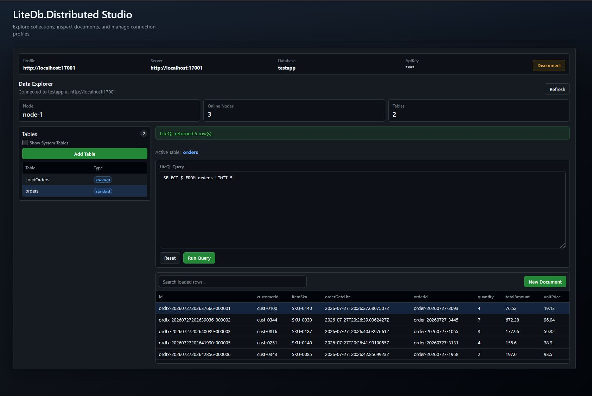

# LiteDb.Distributed

A local-first distributed document store built on LiteDB.

Each node writes to its own local LiteDB file. Changes are captured in an operation log, replicated to peers in the background, and replayed idempotently until the cluster converges.




## Why It Exists

Some systems should keep working even when the network is messy:

- store/POS branches
- on-prem desktop clusters
- edge apps
- lightweight replicated cache workloads
- small self-hosted systems that need durable local writes

LiteDb.Distributed is designed for those environments. It favors local durability, simple deployment, and eventual peer convergence over centralized always-online infrastructure.

## What You Get

- Local-first document writes
- One LiteDB file per logical database
- Operation-log driven replication
- Idempotent push/pull sync
- Peer checkpoints and catch-up status
- Replicated TTL cache
- Safe LiteQL-style query endpoint
- Dashboard and browser-based Studio
- Load/soak samples for production readiness checks

## The Shape

```text
App / API Client
      |
      v
Local Node
      |
      +--> {database}.db
      |       business documents
      |       operation log
      |       replication metadata
      |
      +--> async push/pull replication
              peers converge in the background
```

## Quick Start

Run one node:

```powershell
dotnet run --project .\LiteDb.Distributed.Server\LiteDb.Distributed.Server.csproj
```

Run the browser Studio:

```powershell
dotnet run --project .\LiteDb.Distributed.Studio\LiteDb.Distributed.Studio.csproj
```

Run all sample nodes with Aspire:

```powershell
dotnet run --project .\LiteDb.Distributed.AspireHost\LiteDb.Distributed.AspireHost.csproj
```

Default Aspire node URLs:

- `http://localhost:17001`
- `http://localhost:17002`
- `http://localhost:17003`

## Try The Samples

Generate document writes:

```powershell
dotnet run --project .\Samples\SaveFewRecordsSample\SaveFewRecordsSample.csproj
```

Measure cache replication visibility across all peers:

```powershell
dotnet run --project .\Samples\DistributedCacheProbe\DistributedCacheProbe.csproj
```

Run a sustained write/replication soak test:

```powershell
dotnet run --project .\Samples\ClusterSoakTest\ClusterSoakTest.csproj
```

## When To Use It

Use LiteDb.Distributed when you want:

- local writes that do not depend on network availability
- small replicated clusters
- embedded/self-hosted persistence
- durable documents and replicated cache in one system
- operational simplicity over global consensus

Use something else when you need:

- global exactly-once guarantees
- consensus-backed distributed locking
- ultra-high-QPS centralized cache semantics
- managed Redis-specific features

## Documentation

- [Architecture](./docs/ARCHITECTURE.md)
- [API](./docs/API.md)
- [API Quickstart](./docs/API_QUICKSTART.md)
- [Cache API](./docs/CACHE_API.md)
- [Webhook Ingestion](./docs/WEBHOOKS.md)
- [Configuration](./docs/CONFIGURATION.md)
- [Production Notes](./docs/PRODUCTION.md)
- [Samples](./docs/SAMPLES.md)

## Tests

```powershell
dotnet test .\LiteDb.Distributed.sln
```
