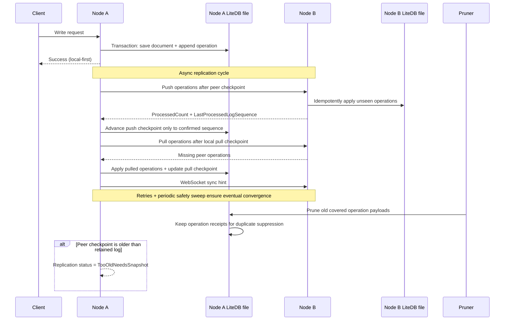

# Architecture

LiteDb.Distributed is a local-first replicated document store built around one simple rule: a node must be able to commit locally without waiting for the network.

Each logical database is stored as a single LiteDB file per node. That file contains business documents and replication metadata, so a local write and its operation-log entry commit together.

## Replication Model

```text
Client Write
   |
   v
Node A: write business document + append operation log in one LiteDB transaction
   |
   +--> schedule immediate replication dispatch
           |
           +--> HTTP push/pull operations with peers
           |
           +--> WebSocket sync-request signals as low-latency hints
           |
           +--> retry with backoff on failure
           |
           +--> periodic safety sweep catches missed work
```

## Write Flow

```text
POST/PUT/DELETE /api/documents/{collection}
   -> validate request
   -> write local materialized state in {database}.db
   -> append operation in reserved metadata collections in the same file
   -> return success immediately
   -> replicate asynchronously
```

## Push/Pull And Checkpoints

Peer progress is tracked with checkpoints. During push, the source node sends operations after the peer's last confirmed checkpoint. The peer idempotently ingests the batch and returns:

- `ProcessedCount`
- `AcceptedCount`
- `LastProcessedLogSequence`

The source advances its push checkpoint only to the peer-confirmed processed log sequence. This prevents data loss when a peer accepts only part of a batch.

Pull works in the other direction: a node asks its peer for operations after the local pull checkpoint and applies missing operations idempotently.

## WebSocket Signals

WebSockets do not carry operation data. They are a wake-up hint.

| Mechanism | Purpose | Carries operation data? | Reliability role |
| --- | --- | --- | --- |
| `GET /ws/replication` | Low-latency peer signal | No | Fast hint path |
| `POST /api/replication/push` | Send local operations to peer | Yes | Primary data replication |
| `POST /api/replication/pull` | Fetch peer operations after checkpoint | Yes | Primary catch-up path |

Dropped WebSocket signals do not lose data because checkpoints, retries, and the periodic safety sweep are the source of truth.

## Mermaid Sequence



## Pruning And Too-Old Peers

Operation-log pruning is enabled by default. It removes old operation payloads only after active peer checkpoints are safely past them, while compact operation receipts remain longer for duplicate suppression.

If a peer checkpoint falls behind the oldest retained operation payload, status reports `TooOldNeedsSnapshot`. That peer needs a restore/clone workflow before it can safely catch up.
